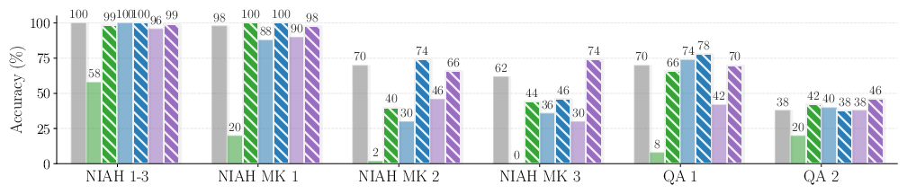
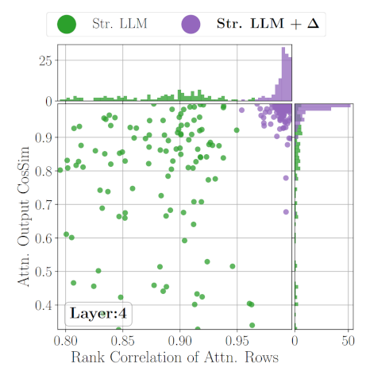

# Delta Attention Fast and Accurate Sparse Attention Inference by Delta Correction



### Introduction

We found that sparse attention has a problem which hurts performance. The key-sparse attention causes a distirbutional
shift in the attention outputs. As the queries of layer `i+1` depend on the attention outputs of layer `i`, this means that 
even if one were to use a sparse attention prefill and a dense attention decode, the decode may fail to match the proper keys
for a given query due to the distributional shift. 



Delta Attention solves a problem by performing query-sparse (and key-dense) attention for a small subset of query tokens in addition to
the query-dense (and key-sparse) sparse attention method. We then take the difference between the query sparse output and the sparse attention 
output. The difference is then repeated for all missing queries and summed together with the key-sparse attention. The
result is an attention output that is closer in cosine similarity to the full quadratic attention with minimal added
overhead


For more details, please have a look at our [paper here](https://arxiv.org/pdf/2505.11254)

# Usage

We provide a simple implementation with an openai server here. To run the server, execute the following commands

```bash
pip install -r requirements.txt
chmod +x ./run-server-hf.sh
./run-server-hf.sh
```

`run-server-hf.sh` calls `server_hf.py` which starts a simple openai style server at the port specified in
`run-server-hf.sh`. The arguments for `server_hf.py` can be changed according to the following.

```text
usage: server_hf.py [-h] [--model-str MODEL_STR] [--attn-implementation ATTN_IMPLEMENTATION] [--mode MODE] [--hip-attn-args HIP_ATTN_ARGS] [--port PORT] [--host HOST]
                    [--no-trust-remote-code] [--delta-lambda DELTA_LAMBDA] [--sliding-window SLIDING_WINDOW]

options:
  -h, --help            show this help message and exit
  --model-str MODEL_STR
  --attn-implementation ATTN_IMPLEMENTATION
  --mode MODE
  --hip-attn-args HIP_ATTN_ARGS
  --port PORT
  --host HOST
  --no-trust-remote-code
  --delta-lambda DELTA_LAMBDA
  --sliding-window SLIDING_WINDOW
```

# Citation

```
``@inproceedings{willette2025delta,
  title     = {Delta Attention: Fast and Accurate Sparse Attention Inference by Delta Correction},
  author    = {Willette, Jeffrey and Lee, Heejun and Hwang, Sung Ju},
  booktitle = {Advances in Neural Information Processing Systems (NeurIPS)},
  year      = {2025},
  month     = {December},
  eprint    = {2505.11254},
  archivePrefix = {arXiv},
  primaryClass  = {cs.LG},
  url       = {https://arxiv.org/abs/2505.11254}
}`
